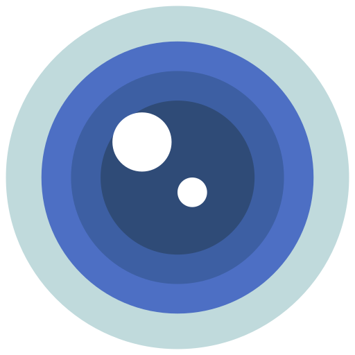
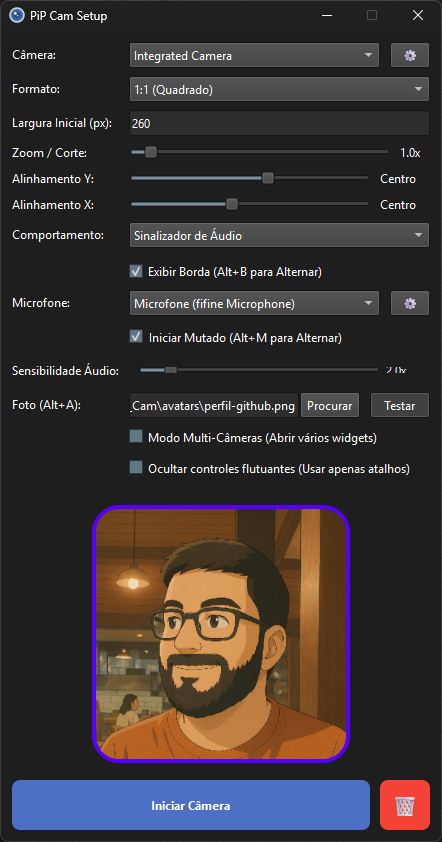
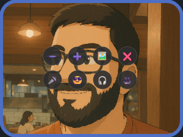
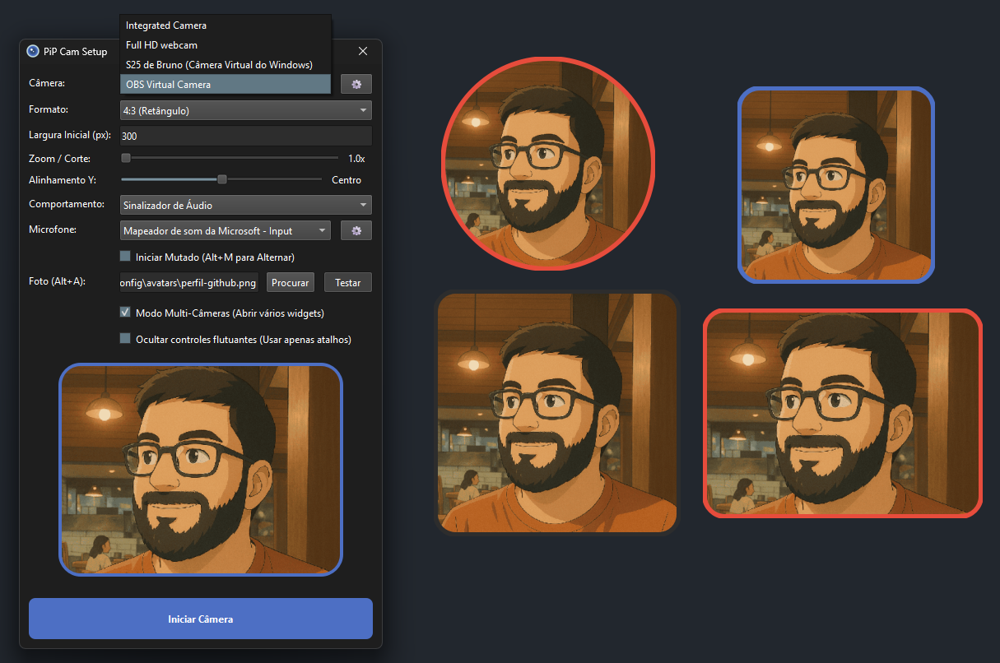

<!-- markdownlint-disable MD033 MD045 -->

# PiP Cam


<p align="center"></p>

PiP Cam é um widget de câmera flutuante inteligente desenvolvido com **Python 3.12+** e **PyQt6**. Provides a highly customizable, always-on-top webcam overlay designed for content creators, streamers, and presenters who need a persistent picture-in-picture feed during screen sharing or live broadcasts.

## Visão Geral

PiP Cam resolve um problema comum para streamers e apresentadores: necessidade de uma visão persistente de webcam enquanto usam software de captura de tela que não suporta nativamente picture-in-picture. O aplicativo cria uma janela flutuante sem borda e sempre visível que permanece sobre outras aplicações, com processamento de vídeo em tempo real, mascaramento de formas geométricas e feedback visual reativo ao áudio.

O aplicativo opera em dois modos:

1. **Modo Configuração (Launcher)**: Uma interface de configuração para selecionar câmeras, ajustar parâmetros e iniciar widgets
2. **Modo Widget**: A sobreposição de câmera flutuante com controles interativos

## Screenshots

| Configuração Launcher             | Widget Flutuante                      |
|:---------------------------------:|:-------------------------------------:|
|  |  |

| Modo Multi-Câmera                           |
|:-------------------------------------------:|
|  |

## Funcionalidades

### Formas Geométricas

- **Círculo**: Máscara circular com borda com anti-aliasing
- **Quadrado (1:1)**: Retângulo com cantos arredondados em proporção 1:1
- **Retângulo (4:3)**: Proporção clássica 4:3 com cantos arredondados

### Suporte Multi-Câmera

- Inicie múltiplas instâncias independentes de widget de diferentes câmeras simultaneamente
- Cada widget mantém seu próprio estado (posição, tamanho, zoom, formato)
- Navegue pelas câmeras disponíveis com atalhos globais

### Modo Avatar

- Alterna entre feed de câmera ao vivo e uma foto de perfil estática
- Suporta formatos PNG, JPG e JPEG
- A imagem é cortada ao centro para preencher as dimensões do widget

### Sistema de Memória Inteligente

- Armazenamento de configuração por câmera:
  - Nível de zoom (100%-500%)
  - Posição Pan X/Y (0-100%)
  - Tamanho do widget (pixels)
  - Posição da janela (coordenadas X, Y)
- Persistência de configurações globais:
  - Última câmera selecionada
  - Último formato usado
  - Cor da borda
  - Modo da borda
  - Caminho do avatar
  - Dispositivo de microfone

### Filtragem de Dispositivos

- Exclua câmeras ou microfones indesejados das listas de dispositivos
- Dispositivos filtrados são ocultados mas não desabilitados no nível do SO

### Modo Slim (Minimalista)

- Oculta controles da barra flutuante
- Opera o widget exclusivamente via atalhos globais

## Arquitetura

O projeto segue uma arquitetura inspirada em MVC com separação clara entre lógica de negócio, componentes de UI e utilitários.

```text
pip-cam/
├── main.py                      # Ponto de entrada do aplicativo
├── pyproject.toml               # Metadados do projeto e dependências
├── inno-setup-action.iss        # Script para gerar instalador Windows
├── classes/
│   ├── core/                    # Camada de lógica de negócio
│   │   ├── config_manager.py    # Singleton de configuração com I/O debounced
│   │   ├── device_manager.py    # Enumeração de câmera/microfone
│   │   ├── video_processor.py   # Processamento de frames e geração de máscaras
│   │   ├── audio_analyzer.py    # Análise de RMS de áudio em tempo real
│   │   └── hotkey_manager.py    # Atalhos de teclado globais
│   ├── views/                   # Widgets principais de UI
│   │   ├── launcher.py          # Janela de configuração
│   │   └── pip_widget.py        # Widget de câmera flutuante
│   ├── ui/                      # Componentes reutilizáveis de UI
│   │   ├── floating_toolbar.py  # Botões de controle do overlay
│   │   └── filter_dialogs.py    # Diálogos de filtragem de dispositivos
│   └── shortcut_signals.py      # Definições de sinais PyQt
├── utils/
│   └── functions.py             # Leitura/escrita de config, caminhos de recursos, migrações
├── assets/                      # Ícones e imagens
└── docs/                        # Documentação
```

## Atalhos Globais

Todos os atalhos usam o modificador `Alt` e funcionam em todo o sistema, mesmo quando o aplicativo não está em foco.

| Atalho    | Ação                                                   |
|:--------- | ------------------------------------------------------ |
| `Alt + S` | Alternar visibilidade do widget (fade in/out)          |
| `Alt + C` | Navegar pelas câmeras disponíveis                      |
| `Alt + M` | Alternar mute do microfone                             |
| `Alt + A` | Alternar modo avatar (câmera ↔ foto de perfil)         |
| `Alt + F` | Navegar pelas formas geométricas (Círculo → 1:1 → 4:3) |
| `Alt + D` | Alternar modo da borda (Cor Sólida ↔ Reativo ao Áudio) |
| `Alt + +` | Aumentar tamanho do widget (+20px)                     |
| `Alt + -` | Diminuir tamanho do widget (-20px)                     |
| `Esc`     | Fechar widget e retornar ao launcher                   |

## Requisitos

- **Sistema Operacional**: Windows 10/11 (alvo principal)
- **Python**: 3.12+ (testado em 3.12 e 3.14)
- **Dependências**: Ver `pyproject.toml`

### Dependências Python

```text
keyboard>=0.13.5         # Hooks globais de teclado
numpy>=2.2.6             # Operações numéricas para processamento de áudio
opencv-python>=4.13.0.92 # Captura de vídeo e manipulação de frames
pygrabber>=0.2           # Enumeração de dispositivos DirectShow (Windows)
pyqt6>=6.11.0            # Bindings Qt6 para GUI
sounddevice>=0.5.5       # Stream de entrada de áudio
```

## Instalação

### Usando [uv](https://github.com/astral-sh/uv)

> Caso não tenha o uv em sua máquina, link para instalação [aqui](https://docs.astral.sh/uv/getting-started/installation/).

```bash
# Clone o repositório
git clone https://github.com/silv4b/pip-cam.git
cd pip-cam

# Instale as dependências
uv sync

# Execute o aplicativo
uv run main.py
```

## Compilação a partir do Código Fonte

### Build de Desenvolvimento

```bash
uv build
```

Isso executa o PyInstaller com as seguintes opções:

- Saída em arquivo único (`--onefile`)
- Modo windowed (sem console, `--windowed`)
- Ícone customizado (`assets/pipcam_icon.ico`)
- Agrupa diretórios `classes/`, `utils/` e `assets/`

Saída: `dist/pipcamwin.exe`

### Instalador Windows (Inno Setup)

O projeto inclui `inno-setup-action.iss` para criar um instalador Windows. Abra o arquivo no Inno Setup Compiler para gerar `PipCamSetup.exe`.

## Configuração

### Local de Armazenamento

As configurações do projeto são salvas em:  `%APPDATA%/PiP_Cam/` no Windows.

### Estrutura do Arquivo de Configuração (`pip_config.json`)

```json
{
    "border_color": "#4d6fc4", // default color
    "border_mode": "Cor Sólida", // default mode
    "last_mode": "Círculo", // default shape
    "last_camera_name": "USB Camera", // default camera
    "use_avatar": false, // default avatar
    "avatar_path": "C:\\Users\\...\\avatar.png",
    "multi_cam_mode": false,
    "hide_toolbar": false,
    "starts_muted": false,
    "ignored_cameras": [],
    "ignored_mics": [],
    "mic_device": 0,
    "USB Camera_Círculo": {
        "size": 300,
        "zoom": 100,
        "pan_x": 50,
        "pan_y": 50,
        "x": 960,
        "y": 540
    }
}
```

### Migração Automática

O aplicativo migra automaticamente arquivos de configuração legados de:

- `pip_config.json` local → `%APPDATA%/PiP_Cam/`
- Diretório `avatar/` local → `%APPDATA%/PiP_Cam/avatars/`

## Uso

1. **Inicie o aplicativo**: Execute `main.py` ou `pipcamwin.exe`
2. **Configure no Launcher**:
   - Selecione uma câmera no dropdown
   - Escolha o formato geométrico (Círculo, Quadrado, Retângulo)
   - Ajuste a largura inicial (100-2000px)
   - Defina o nível de zoom (1.0x-5.0x)
   - Configure o alinhamento Pan (eixos X e Y)
   - Escolha o comportamento da borda (Cor Sólida ou Reativo ao Áudio)
   - Opcionalmente selecione uma imagem de avatar
   - Habilite o modo Multi-Câmera para múltiplas instâncias
   - Habilite o modo Slim para ocultar a toolbar
3. **Clique em "Iniciar Câmera"** para criar o widget flutuante
4. **Posicione e redimensione** o widget arrastando
5. **Use os atalhos globais** para controlar todos os widgets abertos simultaneamente

## Licença

Este projeto está sob a Licença MIT. Veja o arquivo [LICENSE](LICENSE) para detalhes.

## Aviso

O último release do GitHub ([v1.2.3.1-alpha](https://github.com/silv4b/pip-cam/releases/tag/v1.2.3.1-alpha) pode estar atrás do código fonte. O projeto está em desenvolvimento ativo, e funcionalidades ou correções de bugs presentes no branch principal podem não estar refletidas no release publicado. Para a versão mais atualizada, compile a partir do código fonte seguindo as instruções acima.
